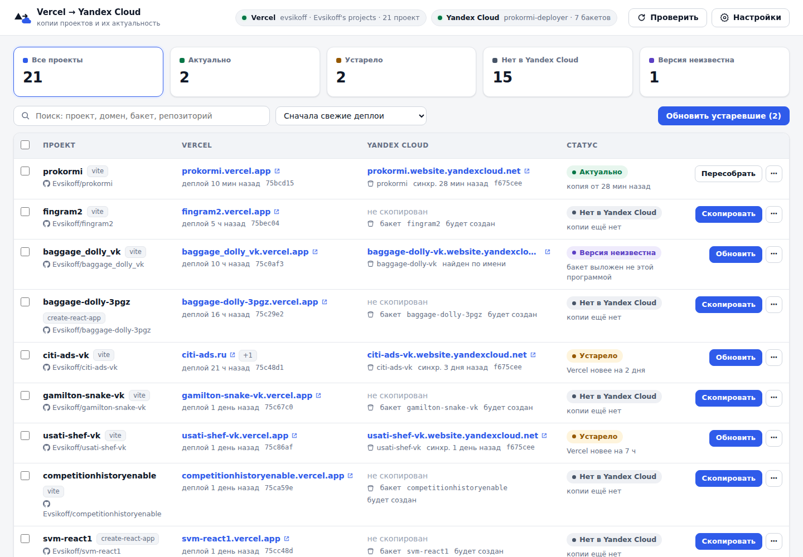

# Vercel → Yandex Cloud

Программа с веб-интерфейсом для переноса сайтов с Vercel в Yandex Cloud (Object Storage). Она:

1. находит **все ваши проекты на Vercel** (во всех командах) и показывает ссылки на сайты;
2. находит **бакеты Object Storage** вашего сервисного аккаунта Yandex Cloud (название аккаунта — любое) и сопоставляет их с проектами;
3. **копирует проект в Yandex Cloud в один клик**: собирает тот же коммит, что сейчас в продакшне на Vercel, и выкладывает его в бакет с включённым хостингом сайта;
4. **следит за актуальностью** копий: если на Vercel появился новый деплой, копия помечается «Устарело», и её можно обновить одной кнопкой — по одной, выбранные или все сразу.



В каждой строке есть ссылки на обе версии сайта: адрес на Vercel (например, `my-site.vercel.app`) и адрес в Yandex Cloud (`my-site.website.yandexcloud.net`). Там же — ссылки на проект в панели Vercel и на репозиторий.

## Что нужно

- **Windows 10/11** (работает и на macOS/Linux).
- **Node.js 18 или новее** — https://nodejs.org. Внешние npm-пакеты программе не нужны.
- **Git** — https://git-scm.com. Нужен, чтобы скачать исходники нужного коммита.
- **Сервисный аккаунт Yandex Cloud** с любым названием и его **статический ключ доступа** в файле `yc-keys.env`
  рядом с программой — как их получить, подробно описано ниже в разделе
  [«Сервисный аккаунт Yandex Cloud»](#сервисный-аккаунт-yandex-cloud).
- **Токен Vercel**: создайте на https://vercel.com/account/tokens (Scope — ваша команда или Full Account).

## Запуск

1. Скачайте репозиторий (`git clone` или Code → Download ZIP) в любую папку.
2. Положите в эту папку файл `yc-keys.env` с ключами сервисного аккаунта
   (см. [«Сервисный аккаунт Yandex Cloud»](#сервисный-аккаунт-yandex-cloud)).
   Образец — `yc-keys.env.example`.
3. Дважды щёлкните **`start.cmd`**. Откроется окно консоли и браузер с адресом `http://127.0.0.1:5178/`.
   Не закрывайте окно консоли, пока работаете с программой.
4. При первом запуске вставьте токен Vercel в поле на странице. Он сохранится только на этом компьютере.

Токен можно не вводить в интерфейсе, а добавить строкой `VERCEL_TOKEN=...` в тот же файл `yc-keys.env`
или в переменную окружения `VERCEL_TOKEN`. Если на компьютере выполнен вход в Vercel CLI (`vercel login`),
программа попробует взять токен оттуда.

На macOS/Linux запуск: `./start.sh` (или `npm start`).

## Сервисный аккаунт Yandex Cloud

Программа работает с Object Storage от имени **сервисного аккаунта** — «робота» в вашем облаке — по его
**статическому ключу доступа**. Название аккаунта может быть любым (`site-deployer`, `vercel-sync`,
`prokormi-deployer` — неважно): программа узнаёт аккаунт по ключам, а не по имени.
Если подходящий аккаунт у вас уже есть, достаточно создать для него ключ (шаг 3) и положить его в файл (шаг 4).

### 1. Подготовьте облако и каталог

1. Войдите в [консоль Yandex Cloud](https://console.yandex.cloud). Если облака ещё нет, консоль предложит
   его создать вместе с каталогом `default`.
2. Убедитесь, что к облаку привязан **активный платёжный аккаунт** ([Биллинг](https://billing.yandex.cloud)) —
   без него Object Storage не даст создать бакет. Хранение небольших сайтов стоит копейки.
3. Выберите **каталог**, в котором будут лежать бакеты с сайтами (например, `default`). Бакеты создаются
   в каталоге сервисного аккаунта, и программа видит только бакеты этого каталога.

### 2. Создайте сервисный аккаунт

1. В консоли откройте нужный каталог, затем в меню сервисов — **Identity and Access Management** →
   **Сервисные аккаунты** → **Создать сервисный аккаунт**.
2. **Имя** — любое, по правилам Yandex Cloud: от 3 до 63 символов, строчные латинские буквы, цифры и дефисы,
   начинается с буквы и не заканчивается дефисом. Например, `site-deployer`. Описание — по желанию.
3. В поле **Роли в каталоге** нажмите **Добавить роль** и выберите **`storage.admin`**.
4. Нажмите **Создать**.

Про роль. Программа создаёт бакеты, включает в них хостинг сайта, **открывает публичное чтение** и
загружает/удаляет файлы. Всё это умеет `storage.admin`. Если не хотите давать аккаунту администраторскую роль,
можно выдать `storage.editor`: копирование и обновление будут работать, но открыть публичный доступ к **новому**
бакету программа не сможет — лог подскажет; тогда в консоли откройте бакет → **Настройки** и включите
публичный доступ на **чтение объектов**.
Роли можно поменять позже: каталог → **Права доступа**.

### 3. Создайте статический ключ доступа

1. Откройте созданный сервисный аккаунт (IAM → Сервисные аккаунты → имя аккаунта).
2. Нажмите **Создать новый ключ** → **Создать статический ключ доступа**. Описание — по желанию
   (например, «Vercel → Yandex Cloud на моём компьютере»). Нажмите **Создать**.
3. Консоль покажет два значения: **Идентификатор ключа** и **Ваш секретный ключ**.
   **Секретный ключ показывается только один раз** — скопируйте оба значения сразу. Если секрет потерян,
   просто создайте новый ключ, а старый удалите.

### 4. Сохраните ключи в файл

Создайте в папке программы файл **`yc-keys.env`** (удобно скопировать `yc-keys.env.example` и переименовать)
и впишите значения из шага 3:

```
YC_ACCESS_KEY_ID=идентификатор ключа
YC_SECRET_ACCESS_KEY=секретный ключ
YC_SERVICE_ACCOUNT=site-deployer
```

- Последняя строка необязательна: имя нужно только для подписи в шапке программы. Его же можно указать
  в «Настройках». Без него в шапке будет показано начало ключа.
- В Windows включите в Проводнике «Вид → Расширения имён файлов», чтобы файл не превратился
  в `yc-keys.env.txt`. В Блокноте при сохранении выберите «Тип файла: Все файлы».
- Файл `yc-keys.env` добавлен в `.gitignore` и не попадёт в git.

Где ещё программа ищет ключи (по порядку):

1. файл, указанный в «Настройках» (поле «Файл с ключами…») — если ключи лежат в другом месте;
2. файл из переменной окружения `YC_ENV_FILE`;
3. переменные окружения `YC_ACCESS_KEY_ID` и `YC_SECRET_ACCESS_KEY` (и необязательная `YC_SERVICE_ACCOUNT`);
4. `yc-keys.env` в папке программы;
5. `.yc-keys.env` или `yc-keys.env` в папке пользователя (`C:\Users\<имя>\`, `~/`);
6. `Tracing\.yc-prokormi.env` и `.yc-prokormi.env` в папке пользователя — имена из первых версий программы.

Кроме формата `КЛЮЧ=значение`, программа понимает вывод команды `yc iam access-key create` как есть
(строки `key_id:` и `secret:`), в том числе сохранённый PowerShell в кодировке UTF-16.

### То же через командную строку `yc`

Если установлен [Yandex Cloud CLI](https://yandex.cloud/ru/docs/cli/quickstart) и выполнен `yc init`
(выбран нужный каталог):

```bash
# 1. Сервисный аккаунт с любым именем
yc iam service-account create --name site-deployer

# 2. Роль storage.admin на текущий каталог (нужна утилита jq)
yc resource-manager folder add-access-binding "$(yc config get folder-id)" \
  --role storage.admin \
  --subject serviceAccount:"$(yc iam service-account get site-deployer --format json | jq -r .id)"

# 3. Статический ключ — сразу в файл программы (в выводе есть секрет, не показывайте его никому)
yc iam access-key create --service-account-name site-deployer > yc-keys.env
```

В PowerShell вместо шага 2:

```powershell
$folder = yc config get folder-id
$sa = (yc iam service-account get site-deployer --format json | ConvertFrom-Json).id
yc resource-manager folder add-access-binding $folder --role storage.admin --subject "serviceAccount:$sa"
```

### Проверка

Запустите программу: в шапке у «Yandex Cloud» должна гореть зелёная точка, имя аккаунта (или начало ключа)
и число бакетов. Если точка красная — наведите на неё или откройте «Настройки»: там написано, какой файл
использован и что не так. Частые причины:

- **«Не найдены ключи»** — файл лежит не там или называется `yc-keys.env.txt`;
- **`InvalidAccessKeyId` / `SignatureDoesNotMatch`** — ключ скопирован не полностью или с лишними символами,
  либо ключ удалён;
- **`AccessDenied`** — у аккаунта нет роли `storage.editor`/`storage.admin` в каталоге.

Чтобы сменить аккаунт, замените ключи в файле (или укажите другой файл в «Настройках») и нажмите «Проверить».

## Как пользоваться

- **Скопировать** — для проекта, которого ещё нет в Yandex Cloud. Имя бакета предлагается по имени проекта
  (`baggage_dolly_vk` → `baggage-dolly-vk`); его можно изменить. Имена бакетов уникальны во всём Yandex Cloud:
  если имя занято, программа скажет об этом до начала сборки.
- **Обновить** — пересобрать и выложить текущий продакшн-деплой Vercel в уже существующий бакет.
  Загружаются только изменившиеся файлы, удалённые из сборки — удаляются из бакета.
- **Обновить устаревшие (N)** — одна кнопка для всех копий, отставших от Vercel.
- **Флажки слева** — выбрать несколько проектов и скопировать/обновить их разом (выполняются по очереди).
- **⋯ → Связать с другим бакетом** — если копия лежит в бакете с другим именем.
- **Проверить** — заново прочитать Vercel и Yandex Cloud. Пока страница открыта, проверка повторяется
  автоматически (по умолчанию раз в 10 минут, меняется в настройках).
- Ход работы виден в панели «Задания» справа внизу, у каждого задания есть подробный лог.

### Статусы

| Статус | Что значит |
|---|---|
| **Актуально** | В бакете та же версия, что сейчас в продакшне Vercel (тот же деплой или тот же коммит). |
| **Устарело** | На Vercel есть более новый продакшн-деплой. Видно, насколько Vercel новее. |
| **Изменено вне программы** | После синхронизации `index.html` в бакете кто-то перезаписал (например, выложили вручную). |
| **Версия неизвестна** | Бакет найден, но его выкладывала не эта программа — какая в нём версия, неизвестно. |
| **Нет в Yandex Cloud** | Копии ещё нет. |
| **Нет продакшн-деплоя** | На Vercel нечего копировать. |

### Как находятся пары «проект ↔ бакет»

По порядку приоритета:

1. ручная связь, заданная в интерфейсе;
2. служебный файл `.vercel-sync.json` в бакете — программа кладёт его при каждой выкладке, и по нему узнаёт
   проект и версию даже на другом компьютере (копия этих данных хранится и локально);
3. имя бакета совпадает с именем проекта (регистр, `_` и `-` не важны);
4. имя бакета совпадает с собственным доменом проекта.

Бакеты, для которых пара не нашлась, показаны внизу страницы — их можно связать с проектом вручную.

## Как происходит копирование

1. Программа берёт **текущий продакшн-деплой** проекта на Vercel и его коммит.
2. Скачивает исходники **ровно этого коммита** (`git fetch` по SHA). Для деплоев, сделанных через Vercel CLI
   без git, файлы берутся из самого Vercel.
3. Получает **переменные окружения продакшна** из Vercel (например, `VITE_*` попадают в код при сборке).
   Значения передаются только процессу сборки: они не пишутся ни в лог, ни на диск.
4. Собирает проект теми же командами, что Vercel: сначала `vercel.json`, затем настройки проекта
   (Build/Install Command, Output Directory, Root Directory), затем стандартные значения фреймворка.
   Менеджер пакетов (npm/pnpm/yarn/bun) определяется по lock-файлу. Посторонние конфиги PostCSS выше
   рабочей папки (например, случайный `postcss.config.mjs` в «Загрузках») в сборку не попадают — как и на Vercel.
5. Создаёт бакет (если его нет) в каталоге сервисного аккаунта: публичное чтение,
   хостинг сайта, главная `index.html`, ошибки → `index.html` (чтобы работали адреса SPA) или `404.html`,
   если он есть в сборке.
6. Выкладывает файлы: сначала ресурсы, потом HTML-страницы (чтобы открытая страница не ссылалась на ещё
   не загруженные файлы), с правильными типами и заголовками кэширования
   (`assets/*` — на год, HTML — без кэша).

Первая сборка проекта занимает около минуты плюс время загрузки файлов. Повторное обновление без изменений
в файлах ничего не загружает.

## Ограничения

- В Object Storage можно разместить **только статические сайты**: Vite, Create React App, Vue, Astro и т.п.
  **Серверные функции** (папка `api/`), **SSR** (Next.js без `output: "export"`, Nuxt SSR и т.п.) и middleware
  не переносятся — программа предупредит об этом в логе, а если статической сборки нет, сообщит об ошибке.
- Правила `rewrites`, `redirects`, `headers` из `vercel.json` не переносятся (кроме типичного для SPA
  «всё на index.html»). `cleanUrls: true` поддерживается: для `about.html` создаётся и адрес `/about`.
- Переменные окружения, помеченные на Vercel как **Sensitive**, Vercel не отдаёт — сборка пройдёт без них.
- Программа видит бакеты **только из каталога** сервисного аккаунта (так устроен доступ по статическим ключам).
  Бакеты из других каталогов не видны — для них нужен сервисный аккаунт в том каталоге.
- Для создания бакета с публичным доступом сервисному аккаунту нужна роль `storage.admin`
  (см. [«Сервисный аккаунт Yandex Cloud»](#сервисный-аккаунт-yandex-cloud)). Если открыть доступ не удастся,
  лог подскажет: включите публичное чтение объектов в консоли Yandex Cloud или выдайте аккаунту `storage.admin`.
- Сборка идёт на вашем компьютере: если на Vercel указан Node.js 24, а у вас другая версия, обычно это
  не мешает, но программа предупредит.

### Бакеты, выложенные раньше другим способом

Если бакет с сайтом уже был создан вручную или своим скриптом деплоя, при первом запуске он будет в статусе
«Версия неизвестна». Нажмите «Обновить» — дальше статус будет отслеживаться.
Если потом снова выкладывать сайт тем скриптом, он может удалить `.vercel-sync.json` из бакета; программа
продолжит работать по локальной копии и покажет «Изменено вне программы», если содержимое изменилось.

## Обновление по расписанию (без интерфейса)

Для **Планировщика заданий Windows** есть `update-outdated.cmd` — он обновляет все устаревшие копии и
завершается. Пример: проверка каждый час:

```bat
schtasks /Create /SC HOURLY /TN "Vercel to Yandex Cloud" /TR "\"C:\путь\к\программе\update-outdated.cmd\""
```

Другие команды:

```
node src/cli.js status                       — список проектов и статусы
node src/cli.js update-outdated [--all]      — обновить устаревшие (--all: и с неизвестной версией)
node src/cli.js sync my-site [--bucket=имя]  — скопировать или обновить один проект
```

## Где хранятся данные и безопасность

- `data/config.json` — настройки, токен Vercel (если введён в интерфейсе), ручные связи;
- `data/state.json` — последние синхронизации;
- `data/work/` — рабочие папки сборки (по умолчанию удаляются после успешной выкладки).

Папка `data/` и файл `yc-keys.env` не попадают в git. Ключи Yandex Cloud программа только читает из вашего файла
(или переменных окружения) и никуда не копирует. Дайте сервисному аккаунту роль только на тот каталог, где лежат
сайты, а ненужные ключи удаляйте в консоли (сервисный аккаунт → ключ → **Удалить**).
Веб-интерфейс доступен только с этого компьютера (`127.0.0.1`), а API принимает запросы лишь от открытой
страницы программы.

## Для разработчика

- `src/server.js` — локальный сервер и API; `public/` — интерфейс.
- `src/config.js` — настройки, поиск ключей Yandex Cloud и токена Vercel; `src/vercel.js` — клиент Vercel REST API; `src/s3.js` — клиент Object Storage (S3 API, подпись AWS SigV4).
- `src/overview.js` — сопоставление и статусы; `src/build.js` — исходники и сборка; `src/deploy.js` — выгрузка;
  `src/sync.js` — полный цикл; `src/cli.js` — консольный режим.
- Тесты: `npm test` (без сети — с имитациями Vercel API и Object Storage).
